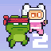
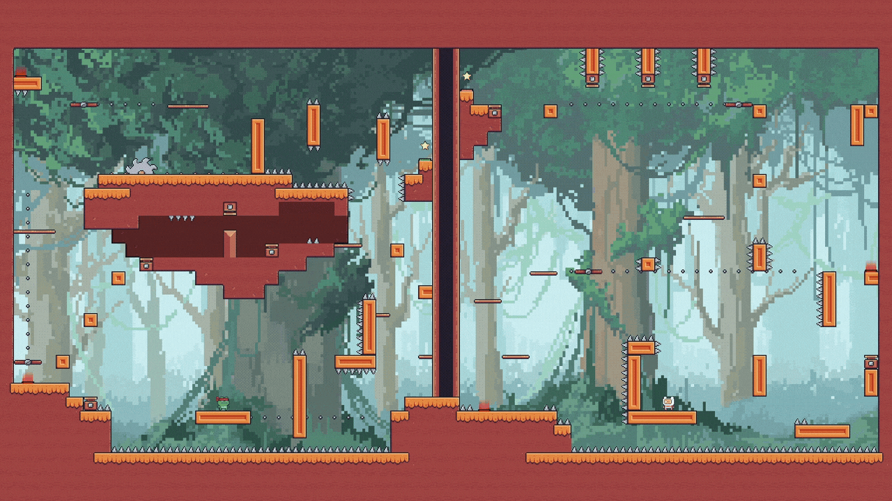
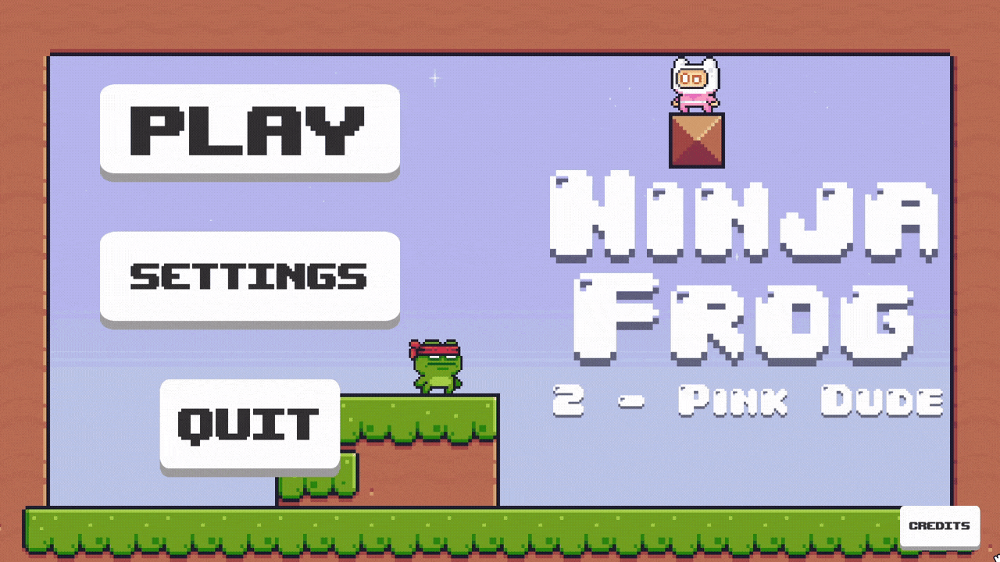

# Ninja Frog 2 - Pink Dude

  

# 

A 2D platformer project built in Unity featuring a level-based adventure with menu, settings, credits, and level selection scenes.

  

## Play in Browser

* **Play on Itch.io:** [Ninja Frog 2 - Pink Dude](https://diptaken.itch.io/ninja-frog-2)
* Note there is a bug with the Itch version. Please click reset data if you are not able to select any levels.
  
## Download

* Latest release: [Ninja Frog 2 - Pink Dude (v1.0.1)](https://github.com/DipTaken/Ninja-Frog-2---Pink-Dude--/releases/tag/v1.0.1)

## Built With

* Unity `2020.3.49f1` (LTS)
* C#

## Features

### Multi-level Progression
Responsive 2D platformer mechanics with retro-style pixel art presentation.

  

### Navigation and Flow
A complete UI flow including a main menu and level selection scenes.

  

### Extensibility
Unity-based scene and gameplay setup designed for easy expansion and settings management.

## Build the Game

1. Open **File > Build Settings** in Unity.
2. Ensure your target platform is selected.
3. Add the scenes you want in the correct order.
4. Click **Build** (or **Build and Run**).

## Notes

* Third-party assets may be subject to their original licenses/copyright.
# hammodeh_game
